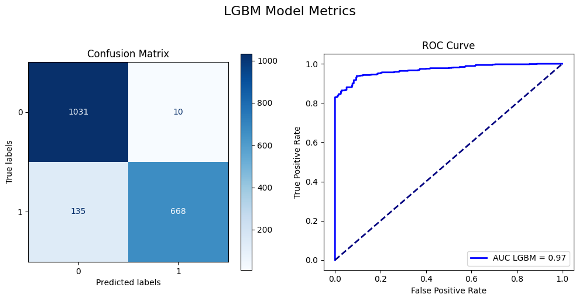

# LGBM Baseline Model Report

## Analytic Approach

- **Target definition:** Anomaly detection (1) vs. normal operation (0) in time tesries data from valve sensors
- **Inputs:** 8-dimensional time series data of various pump characteristics. These dimensions are:

  - Accelerometer1RMS: Measures vibrations in the pump to detect irregularities.
  - Accelerometer2RMS: Similar to the first accelerometer, provides a redundant measure to ensure reliability.
  - Current: Electrical current input to the pump, deviations from norm indicate potential faults.
  - Pressure: The pressure level within the system, critical for detecting leaks or blockages.
  - Temperature: Monitors the operational temperature, high values may indicate overheating.
  - Thermocouple: Provides a second measure of temperature, adding depth to thermal data.
  - Voltage: Voltage levels feeding the pump; fluctuations may signal electrical issues.
  - Volume Flow RateRMS: The rate at which fluid passes through the system, a key metric for operational flow.

- **Model:** LightGBM used for anomaly detection

## Model Description

**Models and Parameters:**

The model utilizes LightGBM, a gradient boosting framework that uses tree-based learning algorithms. The learner's hyper-parameters were optimized through a series of experiments focusing on learning rate, max depth, min data in leaf, and num leaves to balance model complexity and performance. The data flow involves initial data loading, preprocessing (including smoothing and standardization), feature engineering using windowing techniques to capture temporal dependencies, and finally, model training and evaluation.

- **Learner:** LightGBM
- **Hyper-parameters:**

  ```python
  lgb_params={
   'objective':'binary',
   'metric':'binary_error',
   'force_row_wise':True,
   'seed':0,
   'learning_rate':0.0424127,
   'min_data_in_leaf':15,
   'max_depth':24,
   'num_leaves':29
  }
  ```

- Data pre-processing includes smoothing using Kaiser window and standardization.

## Results (Model Performance)

**Performance metrics:**



**F1 Score**: The model achieved an F1 score of approximately 0.898, indicating a strong balance between precision and recall. This high F1 score signifies the model's competence in accurately identifying true positives while maintaining a low rate of false negatives and false positives.

**False Acceptance Rate (FAR)**: The FAR, calculated at 0.024975984630163303, indicates a low proportion of normal instances falsely classified as anomalies. This low rate is essential in operational contexts, reducing the likelihood of unnecessary interventions or investigations that could result from false alarms.

**Missed Alarm Rate (MAR)**: With a MAR of 0.1581569115815691, the model demonstrates a commendable ability to detect actual anomalies, although there is room for improvement. Reducing the MAR further would enhance the model's utility by ensuring fewer genuine anomalies go unnoticed, thus providing more reliable anomaly detection performance.

## Model Understanding

The variable importance analysis highlighted that the minimum of Volume Flow RateRMS (Flow min) was the most significant feature for anomaly detection. This finding aligns with the understanding that anomalies in the dataset often correspond to conditions where the valve is closed, leading to a significant drop in the flow rate. This insight was supported by the strong negative correlation observed between "Volume Flow RateRMS" and the anomaly label.

### Conclusion and Discussions for Next Steps

**Conclusion on Feasibility Assessment:**

The constructed LightGBM model demonstrates high performance in detecting anomalies in time series data, which confirms the feasibility of the machine learning task.

**Discussion on Overfitting:**

Employed early stopping during training to mitigate overfitting.

If overfitting is observed, we will discuss potential mitigation strategies such as:

- Reducing model complexity (e.g., decreasing `max_depth`)
- Applying regularization techniques (e.g., L1/L2 regularization)
- Collecting more training data

**What other Features Can Be Generated from the Current Data?**

We can explore generating additional features from the existing data, such as:

- Statistical moments beyond mean, min, and max (e.g., standard deviation, skewness, kurtosis)
- Frequency-domain features using techniques like Fast Fourier Transform (FFT) to capture frequency patterns related to anomalies.
- Rolling window features to capture changes in sensor readings over time.

**What other Relevant Data Sources Are Available to Help the Modeling?**

- Information about sensor locations and their functionalities might provide context and improve model performance.
- Historical data containing known anomaly events could be used to train a supervised learning model for anomaly detection.
